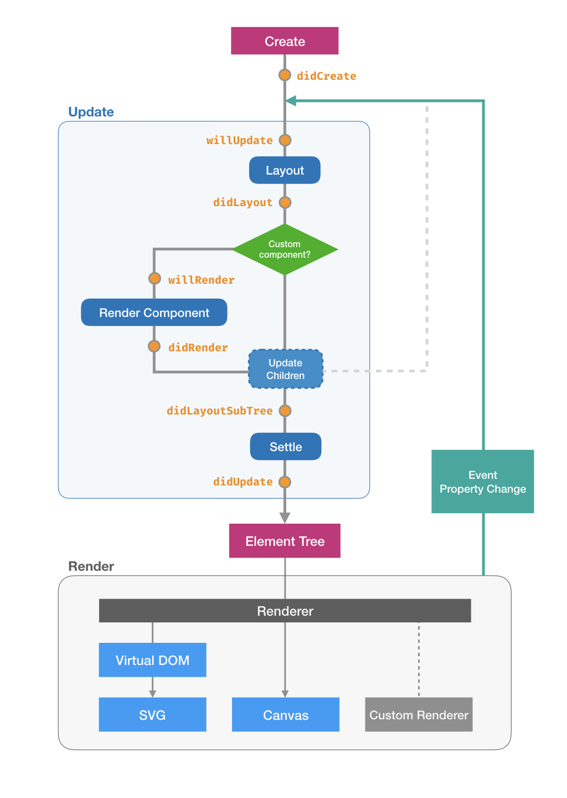

## Lifetime and Hooks

It is possible to run some extra logic when the custom component is created or laid out.
For example, `Container` has a `didLayoutSubTree` hook to update its own size based on its children's sizes.

The following figure shows the lifetime of a component.

After creating, the component mainly experiences two stages:

- **Updating** creates an element tree that contains all computed styles and positions for the whole component.
    - It first **layouts** itself.
    - Then it checks if its a custom component (i.e. whether has a **render function**). If a render function presents,
      the render function is called.
    - Now that all its children are available, it **updates all its children** recursively.
- **Rendering** renders the element tree onto the page via SVG or canvas.

When re-render is needed, the above two stages will be executed again.



### Register hooks

To register hooks, simply add member methods in the class:

```js
class Greetings extends Component<GreetingsOption> {
    public didCreate() {
        console.log("Created!")
    }
}
```

### Some commonly-used hooks

See the [reference](ref/hooks.md) for a list of available hooks.

**Create**

`didCreate`: gets called when the component is created.

**Update**

`didLayout`: get called each time when the layout for itself is finished.
All geometry values are available now.

`willRender`: gets called each time when the component's render function is called.
It is recommended to add prepration logic in this hook.

`didLayoutSubTree`: gets called each time when the layout of all its children has been finished.
It is possible to get children's sizes here.

`didUpdate`: gets called each time when the update is finished.

**Render**

`didMount` (SVG only): gets called when the corresponding SVG element is created.


`didPatch` (SVG only): gets called each time when the corresponding SVG element has been updated.
Two arguments `(oldNode: VNode, newNode: VNode)` are available for this hook.

**Destroy**

`didDestroy`: gets called when the component is destroyed.

## States

The props are readonly in a component. However, components must be mutable in interactive visualizations.
The component may have different appearance when mouse hovered, clicked or data changed;
its children may be updated, moved, created or hidden based on user intertaction.
The **state** system provides a universal solution to internal mutability of components.

The `state` is simply a object member inside a component; state values can be used during rendering, and the most
important property of states is:

!>When its state updated, the component **re-renders automatically**.

```js
class MyComponent extends Component {
    protected state = {
        // states
    }
}
```

To add a state, simply add a new entry in `state`. The key is the name of the stage, and the the value it the default value of this state.

Suppose that we are going to create a component `MousePos`, which renders a circle that moves with the mouse cursor.
Therefore now we need two states: the x and y position of the mouse cursor.

```js
class MousePose extends Component {
    public render = template`
    Component {
        Circle.centered {
            x = state.x
            y = state.y
        }
    }
    `
    protected state = {
        x: 0,
        y: 0,
    }

}
```

`state` can also be referenced inside the template.

Now we are going to update the circle's position on mouse movement. Since the circle's position is connected with the `x` and `y` state,
we only need to update them. Use `setState` to update states.

In the `mousemoved` listener, we use a utility method `mouse` to get the relative mouse position to an element from an event.

```js
class MousePose extends Component {
    public render = template`
    Component {
        on:mousemove = mouseMoved
        Rect.full { fill = "#ccc" };
        Circle.centered {
            x = state.x
            y = state.y
            r = 4
            fill = "red"
        }
    }
    `
    protected state = {
        x: 0,
        y: 0,
    }

    private mouseMoved(ev, el) {
        const [x, y] = Crux.utils.mouse(el, ev);
        this.setState({ x, y });
    }
}
```

<div class="demo" data-height="200">
MousePos {
    width = 100%
    height = 100%
}
</div>
<div class="bvd-code">
class MousePos extends Crux.Component {
    constructor() {
        super()
        this.state = { x: 0, y: 0 }
    }
    mouseMoved(ev, el) {
        const [x, y] = Crux.utils.mouse(el.vnode.elm, ev);
        this.setState({ x, y });
    }
}
MousePos.prototype.render = Crux.template`
Component {
    on:mousemove = mouseMoved
    Rect.full { fill = "#ccc" }
    Circle.centered {
        x = state.x
        y = state.y
        r = 4
        fill = "red"
    }
}
`
MousePos
</div>

!> Never write to `this.state` directly. Use `this.setState()` instead.

?>You might think that the **stage** concept mentioned above sounds quite similar to an internal state; that is correct.
The stage system is based on states, and `setStage(val)` is actually `setState({ stage: val })`.

## Named Children and @yield

Custom components have predefined children in their templates. However, sometimes we may need to customize some children
or add some new children to components. For example, a `BarChart` renders a set of bars using `Rect`. We want to control
how does the bar looks like: its fill color, stroke color, stroke width, stroke line style, etc. It is unfeasible to make
all of these properties props of this `BarChart`. Moreover, what if we want to draw some other decorations on the bar?
How about drawing some other elements instead of the `Rect`?

**Named children** provides a way to solve these problem, and makes it possible to extend and customize components.

Inside the custom component, we use the `@yield` command to yield, or to declare a "slot" for other components to plug in.
The basic syntax of `@yield` looks like `@yield <name>`, where `<name>` is the name of this "slot".

```js
class TwoSlots extends Component {
    public render = template`
    Rows {
        Container {
            Text("This is the 'a' slot:");
        }
        Container {
            @yield a
        }
        Container {
            Text("This is the 'b' slot:");
        }
        ontainer {
            @yield b
        }
    }
    `
}
```

When using this component, we use the following syntax to supply **named children**, which will be inserted to the position
of the corresponsing `@yield`:

```
TwoSlots {
    :a {
        Rect;
    }
    :b {
        Circle;
    }
}
```

<div class="demo" data-height="200">
TwoSlots {
    :a {
        Rect {
            width = 50; height = 20
            fill = "blue"
        }
    }
    :b {
        Circle {
            r = 10; fill = "red"
        }
    }
}
</div>
<div class="bvd-code">
class TwoSlots extends Crux.Component {}
TwoSlots.prototype.render = Crux.template`
Rows {
    Container {
        Text("This is the 'a' slot:");
    }
    Container {
        @yield a
    }
    Container {
        Text("This is the 'b' slot:");
    }
    Container {
        @yield b
    }
}
`
TwoSlots
</div>

### Yield children

`children` is a special name. If the component yields `children`, its direct children will be used.

```js
class Wrapper extends Component {
    public render = template`
    Component {
        x = 10; y = 10; width = 100%-20; height = 100%-20
        Rect {
            y = 20; height = 100%-20; width = 100%
            fill = "none"; stroke = "red"
        }
        Text("Any children will be inserted here");
        Component {
            y = 20
            @yield children
        }
    }
    `
}
```

<div class="demo" data-height="200">
Wrapper {
    width = 100%; height = 100%
    // try add anything!
    Rect {
        width = 50; height = 50
        fill = "blue"
    }
}
</div>
<div class="bvd-code">
class Wrapper extends Crux.Component {}
Wrapper.prototype.render = Crux.template`
Component {
    x = 10; y = 10; width = 100%-20; height = 100%-20
    Rect {
        y = 20; height = 100%-20; width = 100%
        fill = "none"; stroke = "red"
    }
    Text("Any children will be inserted here");
    Component {
        y = 20
        @yield children
    }
}
`
Wrapper
</div>

### Yield with data

It is possible to yield some data at the same time. The syntax looks like `@yield <name> with <data>`.

```js
class MultipleSlots extends Component {
    public render = template`
    Component {
        @let data = [1, 2, 3, 4]
        @for (item, index) in data {
            Component {
                key = index
                y = index * 20
                @yield content with item
            }
        }
    }
    `
}
```

When supplying named children, the block can also capture the data:

```
MultipleSlots {
    :content(data) {
        // ...
    }
}
```

<div class="demo" data-height="200">
MultipleSlots {
    :content(data) {
        Text("Value is " + data);
    }
}
</div>
<div class="bvd-code">
class MultipleSlots extends Crux.Component {}
MultipleSlots.prototype.render = Crux.template`
Component {
    @let data = [1, 2, 3, 4]
    @for (item, index) in data {
        Component {
            key = index
            y = index * 20
            @yield content with item
        }
    }
}
`
MultipleSlots
</div>

?> Note that the supplied named children are rendered multiple times in this example.

?> If the component yields `children` with data, a `:children` block will be required
when using it in order to capture data.

### Yield with defaults

It is also possible to provide a default block so that if the corresponding named children block is not provided,
or `@yield children` is used but the children is empty, the default block will be rendered.

Try adding a default block to `Wrapper`:

```js
class Wrapper extends Component {
    public render = template`
    Component {
        x = 10; y = 10; width = 100%-20; height = 100%-20
        Rect {
            y = 20; height = 100%-20; width = 100%
            fill = "none"; stroke = "red"
        }
        Text("Any children will be inserted here");
        Component {
            y = 20
            @yield children default {
                Text("Empty...");
            }
        }
    }
    `
}
```

<div class="demo" data-height="200">
Wrapper {
    width = 100%; height = 100%
    // no children
}
</div>
<div class="bvd-code">
class Wrapper extends Crux.Component {}
Wrapper.prototype.render = Crux.template`
Component {
    x = 10; y = 10; width = 100%-20; height = 100%-20
    Rect {
        y = 20; height = 100%-20; width = 100%
        fill = "none"; stroke = "red"
    }
    Text("Any children will be inserted here");
    Component {
        y = 20
        @yield children default {
            Text("Empty...");
        }
    }
}
`
Wrapper
</div>

## Dynamic props and @props

Sometimes it might be more clear and expressive if we can customize not only the prop values, but also the names.

The `@props` command provides an easy way to serve a dynamic object as props, so you are free to add any logic before
actually passing the props to a component.

<div class="demo" data-height="200">
Rect {
    @let dynamicProps = {
        width: 50,
        height: 50,
    }
    @props dynamicProps
}
</div>

?> Following `@props` there can be a variable or a simple JavaScript expression, such as a function call.

## Registering Components

You may need to use some other custom components in your template, but the framework does not know where to find them
given only the component name. Therefore, you should also provide a dictionary of custom components used in this template.

If the template is inside a custom component, add `components` as a static member:

```js
class CustomComponent extends Component {
    public static components = { MyComponent }

    public render = template`
    MyComponent {}
    `
}
```

If the template is supplied to `visualize()`, add the `components` option:

```js
Crux.visualize({
    el: "#canvas",
    template,
    components: { MyComponent },
})
```

And if you want, the framework provides a `registerGlobalComponent` method for you to register the component globally.
The component will then be available for all templates.

```js
registerGlobalComponent({ MyComponent })
```

!> Registering a component globally will overwrite existing component with same name.
